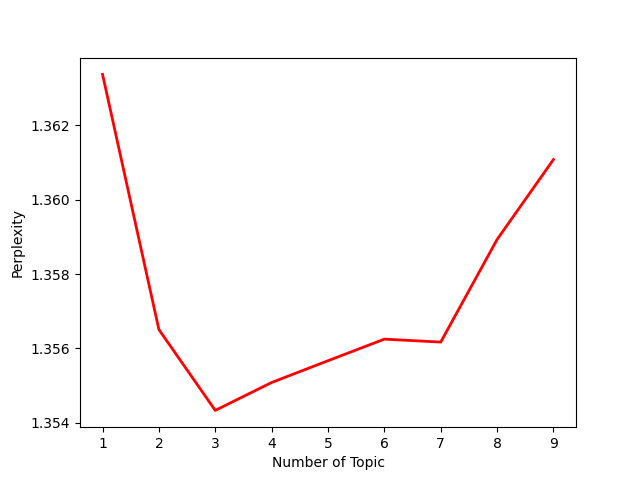

# 舆情分析大数据

#### 介绍
舆情分析大数据

#### 软件架构
开发环境：python，html，js
开发思路：
1.研究舆情目的
2. 如何找到最热的主题
3.怎么确定最优的主题数
4.如何验证自己主题符合这些

#### 使用说明

1.  main.py  主要用来在微博中爬取热点事件
2.  LDA.py   改进版主题模型
3.  词云 html代码.py  生成词云、LDA.html、计算Perplexity-Topics
4.lda.html 只是生成基本的框架，优化需用到html，css和了解D3.js

#### 相关展示

1.  主题迷惑度

2.  词云图

3.  生成网页
